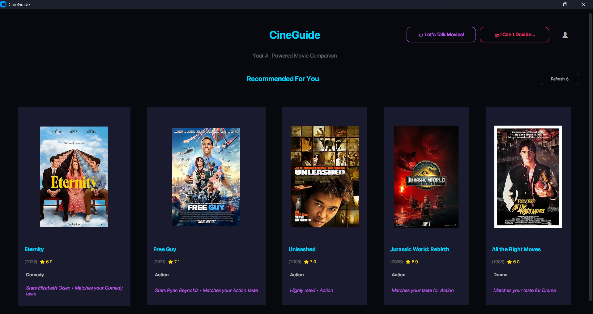
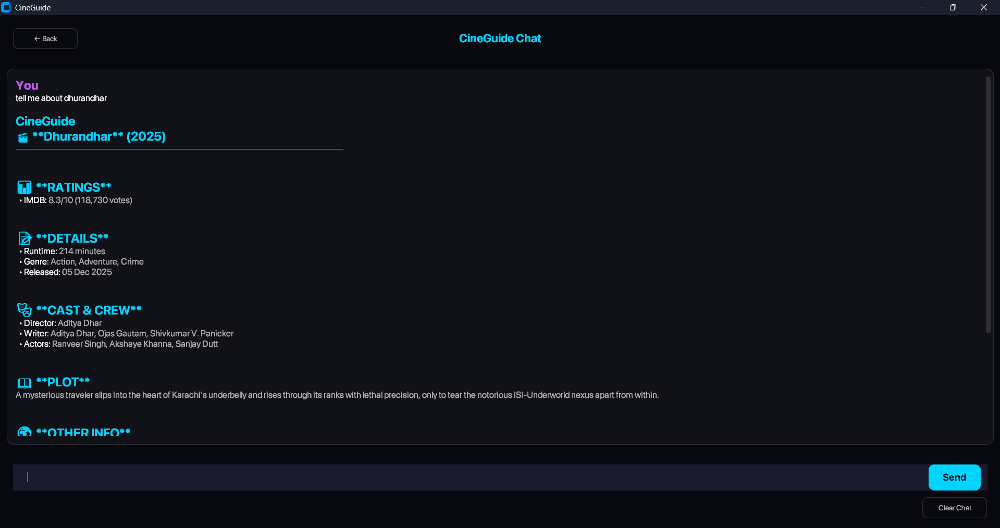
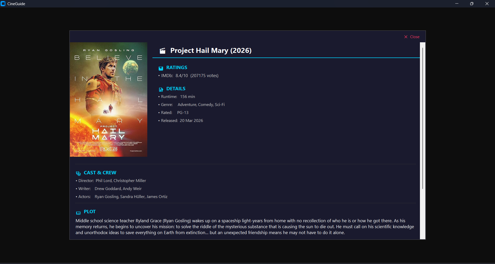
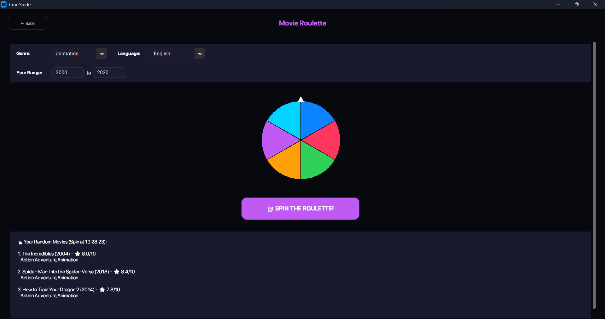
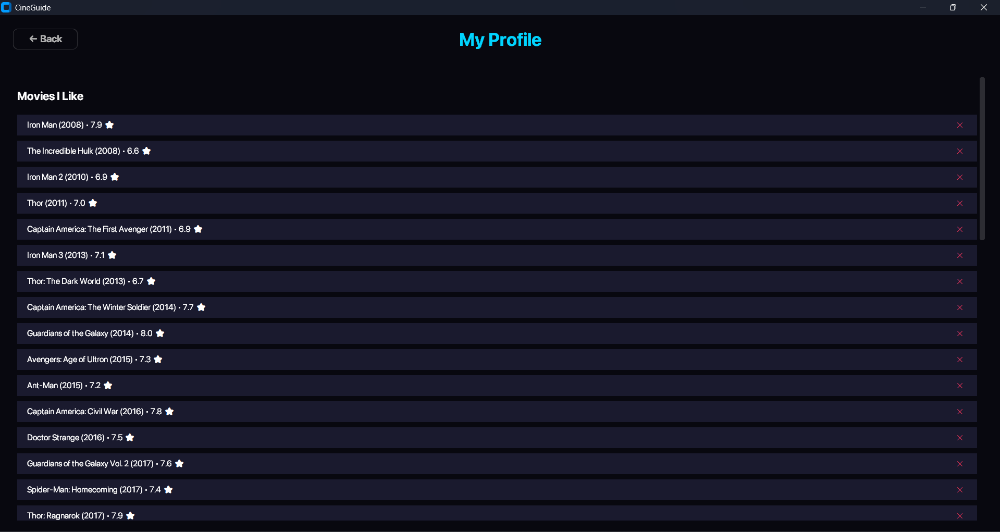

# 🎬 CineGuide - Your AI-Powered Movie Companion

**An intelligent concierge agent for personalized movie discovery, powered by Google's Gemini 2.5 Flash and the Agent Development Kit (ADK).**

A movie companion that blends conversation, profile-driven recommendations, and a redesigned cinematic interface.

---

## 📖 Table of Contents

- [Problem Statement](#-problem-statement)
- [Solution](#-solution)
- [Why Agents?](#-why-agents)
- [Features](#-features)
- [User Profiles](#-user-profiles)
- [Recommendation Engine](#-recommendation-engine)
- [Architecture](#-architecture)
- [ADK Concepts Implemented](#-adk-concepts-implemented)
- [Tech Stack](#-tech-stack)
- [Setup & Installation](#-setup--installation)
- [Usage](#-usage)
- [Database](#-database)
- [Screenshots](#-screenshots)
- [Future Enhancements](#-future-enhancements)

---

## 🎯 Problem Statement

Finding the right movie to watch is overwhelming.

With thousands of streaming options across multiple platforms, users face:
- Decision paralysis from endless scrolling.
- Generic recommendations that do not match their mood or preferences.
- Time wasted searching instead of watching.
- Lack of personalization in traditional recommendation engines.

Existing solutions provide static lists or algorithm-driven suggestions that often miss the conversational, preference-aware experience users actually want.

---

## 💡 Solution

CineGuide is an AI-powered concierge agent that acts as a personal movie expert, offering:

- Conversational movie discovery through natural language.
- Instant movie details including ratings, cast, plot, and awards.
- Profile-based recommendations tailored to each user.
- A recommended for you homepage section with clickable movie cards.
- A refreshable recommendation feed to keep discovery dynamic.
- A redesigned visual experience with modern UI and posters.

The app combines chat, profile learning, and recommendation logic into a single assistant that improves over time as the user interacts with it.

---

## 🤖 Why Agents?

Traditional movie apps use static search and filter systems. Agents make this experience intelligent and conversational.

1. Natural language understanding lets users ask things like "tell me about ddlj" or "movies like Inception."
2. Intent recognition helps the system decide whether the user wants details, search results, top-rated lists, or recommendations.
3. Dynamic tool selection routes each query to the right database or profile function.
4. Contextual memory keeps the interaction connected across sessions.
5. Personalized responses make the app feel like a real concierge instead of a plain search tool.

---

## ✨ Features

### 🗣️ Conversational Chat Interface
- Ask about any movie from the full database.
- Use acronyms and franchise shorthand.
- Get ratings, cast, crew, plot, awards, and direct IMDb links.

### 🔍 Intelligent Search
- Search by title, genre, or keyword.
- Normalize informal genre terms like "scary" or "romcom."
- Support language-aware filtering.

### ⭐ Top Movies Lists
- Browse top-rated movies by genre or language.
- Use custom limits for result size.

### 🎯 Similar Movie Recommendations
- Find movies similar to a chosen title.
- Use rating and genre proximity for discovery.

### 🎰 Movie Roulette
- Random movie picker with filters for genre, language, and year range.
- Visual spinning wheel animation.
- Get multiple random suggestions per spin.

### 👤 User Profiles
- Track movies the user liked and disliked.
- Store favourite genres, directors, and actors.
- Build a richer taste profile over time.
- Connect chat activity directly to profile updates.

### 🧠 Personalized Homepage
- Show a "Recommended for You" section.
- Use profile signals to rank suggestions.
- Display clickable movie cards for quick exploration.
- Include a refresh button to reshuffle recommendations instantly.

---

## 👤 User Profiles

CineGuide now includes individualized user profiles that evolve with usage.

Each profile can include:
- Movies the user liked.
- Movies the user disliked.
- Favourite genres.
- Favourite directors.
- Favourite actors.
- Chat-derived preference signals.

The profile is not just a storage layer. It is directly connected to the chat experience, so user messages can strengthen the profile and improve later recommendations. Over time, the app becomes more accurate about what a user tends to enjoy and what they usually avoid.

This makes the recommendation experience feel more personal, because the app is not only reacting to explicit likes and dislikes, but also learning from conversational context.

---

## 🎯 Recommendation Engine

The recommendation engine uses the profile to generate a homepage feed that feels curated.

It can prioritize:
- Movies from preferred genres.
- Movies featuring favourite directors.
- Movies featuring favourite actors.
- Titles similar to previously liked films.
- Fresh randomized picks within the user’s taste range.

The recommended section uses clickable movie cards so users can jump directly into details without retyping queries. A refresh control allows the feed to rotate and stay discoverable, while still staying aligned with the profile.

This turns the homepage into an active discovery surface rather than a static landing page.

---

## 🏗️ Architecture

┌─────────────────────────────────────────────────────────────┐
│ CineGuide Application                                      │
└─────────────────────────────────────────────────────────────┘
                            │
        ┌───────────────────┴───────────────────┐
        │                                       │
        ▼                                       ▼
┌──────────────────┐                  ┌──────────────────┐
│ GUI Layer        │                  │ Agent Layer      │
│ (CustomTkinter)  │                  │ (ADK + Gemini)   │
└──────────────────┘                  └──────────────────┘
        │                                       │
        │    User Input / Profile Actions        │
        └──────────────────┬────────────────────┘
                           │
                           ▼
                  ┌────────────────────┐
                  │ Query + Profile     │
                  │ Processing Layer    │
                  └────────────────────┘
                           │
        ┌──────────────────┼──────────────────┐
        │                  │                  │
        ▼                  ▼                  ▼
┌──────────────┐  ┌──────────────┐  ┌──────────────┐
│ Database     │  │ Profile      │  │ Memory       │
│ Tools        │  │ Engine       │  │ Service      │
│              │  │              │  │              │
│ - Lookup     │  │ - Likes      │  │ - Session    │
│ - Search     │  │ - Dislikes   │  │ History      │
│ - Top Lists  │  │ - Fav Genres │  │ - Context    │
│ - Similar    │  │ - Fav People  │  │ Retention    │
│ - Random     │  │ - Chat Logs  │  │              │
└──────────────┘  └──────────────┘  └──────────────┘
        │
        ▼
┌─────────────────────────────────────────────┐
│ SQLite Database + Poster API Integration    │
│ - 700K+ movies                              │
│ - Enriched metadata                         │
│ - Poster images via TMDB                    │
└─────────────────────────────────────────────┘

### Data Flow

1. User opens the app and lands on the personalized homepage.
2. The recommendation engine builds the "Recommended for You" section from the user profile.
3. The user chats with CineGuide or clicks a movie card.
4. Chat logs and preferences update the user profile.
5. The profile engine feeds the recommendation logic.
6. The UI refreshes the homepage cards and poster display.

---

## 🎓 ADK Concepts Implemented

This project demonstrates key ADK concepts through a conversational, profile-aware assistant.

### 1. Agent Creation & Configuration
root_agent = Agent(
model=MODEL_NAME,
name='cineguide_agent',
description='Friendly movie assistant',
instruction='You are a friendly and enthusiastic movie assistant...'
)

### 2. Session Management
session_service = InMemorySessionService()
await session_service.create_session(
app_name="cineguide_app",
user_id=self.user_id,
session_id=self.session_id
)

### 3. Memory Service
memory_service = InMemoryMemoryService()
async def auto_save_to_memory(callback_context):
    await callback_context._invocation_context.memory_service.add_session_to_memory(
        callback_context._invocation_context.session
    )

### 4. Runner & Async Execution
runner = Runner(
    agent=root_agent,
    app_name="cineguide_app",
    session_service=session_service,
    memory_service=memory_service,
)

async for event in runner.run_async(
    user_id=self.user_id,
    session_id=self.session_id,
    new_message=message
):
    # Process streaming responses

### 5. Tool Integration
- get_movie_from_db_direct() - Movie lookup.
- search_movies() - Search functionality.
- get_top_movies() - Ranked lists.
- get_similar_movies() - Recommendations.
- get_random_movies() - Randomization.
- profile update and recommendation utilities for user taste modeling.

### 6. Query Parsing & Intent Recognition
- Pattern matching for user queries.
- Acronym expansion.
- Franchise number handling.
- Genre and language normalization.
- Profile-aware routing for recommendation actions.

---

## 🛠️ Tech Stack

- **AI Framework**: Google Agent Development Kit (ADK).
- **LLM**: Gemini 2.5 Flash.
- **Database**: SQLite with 700K+ movies.
- **GUI**: CustomTkinter with modern themed layout.
- **Typography**: Apple SF Pro font.
- **Image Source**: TMDB poster images API.
- **Language**: Python 3.8+.

---

## 🚀 Setup & Installation

### Prerequisites
- Python 3.8 or higher.
- Anaconda recommended, or pip.
- Google API key for Gemini.

### Installation Steps

#### Option 1: Using Anaconda
1. Clone the repository.
```bash
git clone https://github.com/TheKing3006/cineguide.git
cd cineguide
```
2. Create and activate an Anaconda environment.
```bash
conda create -n cineguide python=3.10
conda activate cineguide
```
3. Install dependencies.
```bash
pip install -r requirements.txt
```
4. Set up environment variables.
```bash
cp .env.example .env
```
5. Add your API key to `.env`.
```bash
GOOGLE_API_KEY=your_api_key_here
```
6. Run the application.
```bash
python cineguide.py
```

#### Option 2: Using pip
1. Clone the repository.
```bash
git clone https://github.com/TheKing3006/cineguide.git
cd cineguide
```
2. Create a virtual environment.
```bash
python -m venv venv
```
3. Activate it.
```bash
venv\Scripts\activate
```
4. Install dependencies.
```bash
pip install -r requirements.txt
```
5. Set up `.env`.
```bash
cp .env.example .env
```
6. Run the application.
```bash
python cineguide.py
```

The database is included, so the app launches immediately.

---

## 🎮 Usage

### Chat Mode
1. Open the chat section.
2. Ask anything naturally:
   - "Tell me about Inception"
   - "Best Hindi movies"
   - "Top 10 action movies"
   - "ddlj"
   - "Movies like The Matrix"

### Personal Homepage
1. Open the app home screen.
2. Browse the "Recommended for You" cards.
3. Click any card for full movie details.
4. Press refresh to generate a new personalized set.

### Roulette Mode
1. Open movie roulette.
2. Set optional filters.
3. Spin the wheel.
4. Browse the random suggestions.

---

## 💾 Database

The included `movies.db` contains:
- 700,000+ movies.
- Metadata including title, year, runtime, genre, rating, language, and country.
- IMDb ratings and votes.
- Rotten Tomatoes critics and audience scores.
- Directors, writers, and actors.
- Plot summaries, awards, and box office data.
- IMDb ID links for direct reference.

**Size**: 1.12 GB  
**Format**: SQLite  
**Pre-processed**: Null values fixed, data enriched, and validated.

---

## 📸 Screenshots

### Title Screen


### Chat Interface


### Movie Details


### Movie Roulette


### Profile


---

## 🔮 Future Enhancements

- Multi-agent architecture for search, recommendations, and trivia.
- Streaming service integration for availability lookup.
- Personalized watch history analytics.
- Social features for shared recommendations.
- Voice interface for hands-free discovery.
- Mood-based recommendation modes.
- Cloud deployment with scalable runtime support.

---

## 📝 License

MIT License - free to use and modify.

---

## 🙏 Acknowledgments

- Google for the ADK framework and Gemini models.
- TMDB for poster image support.
- OMDB for movie metadata enrichment.

---

**Built with ❤️ by Rishabh Bhatnagar**